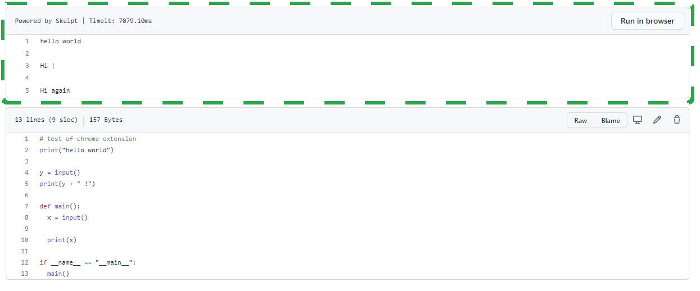
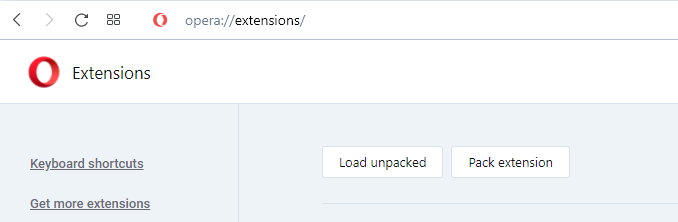

 Run python files from within GitHub file pages.

| |
|:---:|
|  |
| Install this extension in the [Chrome web store](https://chrome.google.com/webstore/). |

## About
| |
|:---:|
|  |
| This extension creates additional UI within the GitHub file viewer, allowing users to run .py (python) files within the browser. |

Powered by [Skulpt](https://github.com/skulpt/skulpt), this extension allows supports the majority of the Python3 language, and includes a wide number of standard library modules.

## Manual installation
| |
|:---:|
|  |
| Navigate to `chrome://extensions` and `load unpacked`. |

1. Clone this repository onto your device.
2. Navigate to `chrome://extensions/` (replace `chrome` with the name of your Chromium-based browser, for instance `opera://extensions/`).
3. Open the file explorer using `Load unpacked` and navigate to the root folder of this repository. 
4. Select this folder, and the extension should load into your list of browser extensions.

## License
MIT